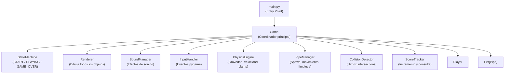
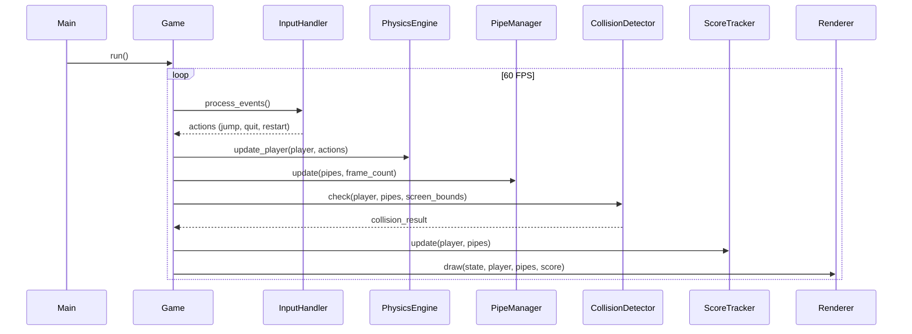

# Design Document: Flappy Kiro

## Overview

Flappy Kiro es un juego 2D de un solo jugador estilo Flappy Bird implementado en Python usando **pygame**. El jugador controla a Ghosty (sprite `assets/ghosty.png`) a través de pares de tubos generados proceduralmente. El objetivo es sobrevivir el mayor tiempo posible evitando colisiones, acumulando un punto por cada par de tubos superado.

### Tecnologías

- **Python 3.10+**
- **pygame 2.x** — motor de renderizado, gestión de eventos, audio y reloj de frames
- **pytest + hypothesis** — testing unitario y property-based testing

### Decisiones de diseño clave

- Arquitectura orientada a componentes con separación clara entre lógica de juego, renderizado y audio.
- El estado del juego se modela como una máquina de estados finita con tres estados: `START`, `PLAYING`, `GAME_OVER`.
- La física del jugador y el movimiento de los tubos son funciones puras sobre estructuras de datos inmutables (dataclasses), lo que facilita el testing.
- Los hitboxes son rectángulos (`pygame.Rect`) para simplicidad y rendimiento.

---

## Architecture

El juego sigue una arquitectura en capas con un bucle de juego central:



### Flujo del bucle de juego



---

## Components and Interfaces

### `Game`

Coordinador principal. Mantiene el estado global y orquesta todos los subsistemas.

```python
class Game:
    def __init__(self) -> None: ...
    def run(self) -> None: ...          # Bucle principal
    def _reset(self) -> None: ...       # Reinicia estado para nueva partida
    def _handle_start(self, actions: Actions) -> None: ...
    def _handle_playing(self, actions: Actions) -> None: ...
    def _handle_game_over(self, actions: Actions) -> None: ...
```

### `Player`

Dataclass que encapsula el estado del jugador.

```python
@dataclass
class Player:
    x: float = 80.0
    y: float = 300.0
    velocity: float = 0.0
    image: pygame.Surface = field(default=None, repr=False)

    @property
    def rect(self) -> pygame.Rect: ...   # Hitbox calculado desde (x, y) e imagen
```

### `Pipe`

Dataclass que representa un par de tubos (superior + inferior).

```python
@dataclass
class Pipe:
    x: float
    gap_center_y: float
    gap_height: float = 150.0
    width: int = 60

    @property
    def top_rect(self) -> pygame.Rect: ...    # Tubo superior
    @property
    def bottom_rect(self) -> pygame.Rect: ...  # Tubo inferior
    @property
    def passed(self) -> bool: ...             # True si el jugador ya lo superó
```

### `PhysicsEngine`

Funciones puras para actualizar la física del jugador.

```python
GRAVITY: float = 0.5
JUMP_VELOCITY: float = -8.0
MAX_FALL_SPEED: float = 10.0

def apply_gravity(player: Player) -> Player: ...
def apply_jump(player: Player) -> Player: ...
def clamp_velocity(player: Player) -> Player: ...
def update_position(player: Player) -> Player: ...
```

### `PipeManager`

Gestiona el ciclo de vida de los tubos.

```python
PIPE_SPAWN_INTERVAL: int = 90   # frames
PIPE_SPEED: float = 3.0
GAP_MIN_Y: int = 150
GAP_MAX_Y: int = 450

def spawn_pipe(frame_count: int, screen_width: int) -> Pipe | None: ...
def move_pipes(pipes: list[Pipe]) -> list[Pipe]: ...
def remove_offscreen(pipes: list[Pipe]) -> list[Pipe]: ...
```

### `CollisionDetector`

Detección de colisiones usando `pygame.Rect.colliderect`.

```python
@dataclass
class ScreenBounds:
    width: int
    height: int

def check_pipe_collision(player: Player, pipes: list[Pipe]) -> bool: ...
def check_boundary_collision(player: Player, bounds: ScreenBounds) -> bool: ...
def check_any_collision(player: Player, pipes: list[Pipe], bounds: ScreenBounds) -> bool: ...
```

### `ScoreTracker`

Lógica de puntuación.

```python
def update_score(score: int, player: Player, pipes: list[Pipe]) -> tuple[int, list[Pipe]]: ...
```

Devuelve el nuevo score y la lista de pipes actualizada (con `passed=True` en los superados).

### `SoundManager`

Carga y reproduce efectos de sonido.

```python
class SoundManager:
    def __init__(self) -> None: ...
    def load(self, jump_path: str, game_over_path: str) -> None: ...
    def play_jump(self) -> None: ...
    def play_game_over(self) -> None: ...
```

### `InputHandler`

Traduce eventos pygame a acciones del dominio.

```python
@dataclass
class Actions:
    jump: bool = False
    quit: bool = False
    restart: bool = False

def process_events(events: list[pygame.event.Event]) -> Actions: ...
```

### `Renderer`

Renderiza todos los elementos en pantalla.

```python
class Renderer:
    def __init__(self, screen: pygame.Surface, font: pygame.font.Font) -> None: ...
    def draw_start(self) -> None: ...
    def draw_playing(self, player: Player, pipes: list[Pipe], score: int) -> None: ...
    def draw_game_over(self, score: int) -> None: ...
```

---

## Data Models

### Estado del juego (máquina de estados)

```python
from enum import Enum, auto

class GameState(Enum):
    START = auto()
    PLAYING = auto()
    GAME_OVER = auto()
```

### Constantes globales

```python
SCREEN_WIDTH: int = 400
SCREEN_HEIGHT: int = 600
FPS: int = 60
PLAYER_X: float = 80.0
GRAVITY: float = 0.5
JUMP_VELOCITY: float = -8.0
MAX_FALL_SPEED: float = 10.0
PIPE_SPEED: float = 3.0
PIPE_SPAWN_INTERVAL: int = 90
GAP_HEIGHT: float = 150.0
GAP_MIN_Y: int = 150
GAP_MAX_Y: int = 450
```

### Estructura de archivos del proyecto

```
flappy_kiro/
├── main.py                  # Entry point
├── game.py                  # Clase Game (coordinador)
├── player.py                # Dataclass Player
├── pipe.py                  # Dataclass Pipe
├── physics.py               # PhysicsEngine (funciones puras)
├── pipe_manager.py          # PipeManager
├── collision.py             # CollisionDetector
├── score.py                 # ScoreTracker
├── sound_manager.py         # SoundManager
├── input_handler.py         # InputHandler + Actions
├── renderer.py              # Renderer
├── constants.py             # Constantes globales
└── tests/
    ├── test_physics.py
    ├── test_pipes.py
    ├── test_collision.py
    ├── test_score.py
    └── test_properties.py   # Property-based tests (hypothesis)
```

---

## Correctness Properties

*A property is a characteristic or behavior that should hold true across all valid executions of a system — essentially, a formal statement about what the system should do. Properties serve as the bridge between human-readable specifications and machine-verifiable correctness guarantees.*

Las siguientes propiedades se derivan del análisis de los criterios de aceptación. Se usan para guiar los tests de propiedad implementados con **Hypothesis**.

---

### Property 1: La gravedad incrementa la velocidad de forma constante

*For any* estado del jugador (cualquier posición y velocidad inicial), aplicar un paso de gravedad debe incrementar la velocidad vertical exactamente en `GRAVITY` (0.5 píxeles/frame²).

**Validates: Requirements 2.1**

---

### Property 2: El salto establece la velocidad a -8

*For any* estado del jugador (cualquier posición y velocidad inicial), aplicar la acción de salto debe establecer la velocidad vertical exactamente a `JUMP_VELOCITY` (-8.0 píxeles/frame).

**Validates: Requirements 2.2**

---

### Property 3: La posición horizontal del jugador es siempre 80

*For any* secuencia de operaciones físicas (gravedad, salto, actualización de posición), la coordenada `x` del jugador debe permanecer siempre igual a 80.0.

**Validates: Requirements 2.4**

---

### Property 4: La velocidad vertical nunca supera el máximo de caída

*For any* valor de velocidad (incluyendo valores mayores que `MAX_FALL_SPEED`), después de aplicar el clamp, la velocidad resultante debe ser siempre ≤ `MAX_FALL_SPEED` (10.0 píxeles/frame).

**Validates: Requirements 2.5**

---

### Property 5: Los tubos spawneados tienen propiedades válidas

*For any* frame en el que se genera un tubo (frame_count % 90 == 0), el tubo resultante debe tener: `gap_center_y` en el rango [150, 450] y `gap_height` igual a 150.0.

**Validates: Requirements 3.1, 3.2, 3.3**

---

### Property 6: El movimiento de tubos desplaza exactamente 3 píxeles a la izquierda

*For any* lista de tubos con posiciones arbitrarias, después de aplicar un paso de movimiento, la coordenada `x` de cada tubo debe disminuir exactamente en `PIPE_SPEED` (3.0 píxeles). Además, los tubos cuyo `x + width < 0` deben ser eliminados de la lista activa.

**Validates: Requirements 3.4, 3.5**

---

### Property 7: La detección de colisiones es correcta para tubos y bordes

*For any* posición del jugador y configuración de tubos: (a) si el rect del jugador se superpone con el rect de cualquier tubo, la colisión debe detectarse; (b) si el rect del jugador está completamente dentro de los límites de la pantalla y no toca ningún tubo, no debe detectarse colisión; (c) si el jugador sale por el borde superior (y < 0) o inferior (y + height > SCREEN_HEIGHT), la colisión de borde debe detectarse.

**Validates: Requirements 4.1, 4.2, 4.3**

---

### Property 8: El score se incrementa exactamente en 1 al superar un tubo

*For any* configuración de jugador y tubos donde el jugador acaba de pasar el borde derecho de un tubo no marcado como superado, el score debe incrementarse exactamente en 1 y el tubo debe marcarse como `passed=True`.

**Validates: Requirements 5.1**

---

### Property 9: El reinicio restaura el estado inicial completo

*For any* estado de juego en `GAME_OVER` (con cualquier score, posición del jugador y lista de tubos), al ejecutar la acción de reinicio, el estado resultante debe ser idéntico al estado inicial: score = 0, jugador en posición inicial, lista de tubos vacía, estado = `START`.

**Validates: Requirements 6.3**

---

## Error Handling

| Situación | Comportamiento esperado |
|---|---|
| Asset no encontrado al iniciar | Mostrar mensaje de error descriptivo y llamar `sys.exit(1)` |
| Error al inicializar pygame | Capturar excepción, mostrar mensaje y salir limpiamente |
| Error al cargar sonido | Loggear advertencia y continuar sin audio (degradación elegante) |
| Evento `QUIT` de pygame | Llamar `pygame.quit()` y `sys.exit(0)` |
| Tecla Escape en `GAME_OVER` | Llamar `pygame.quit()` y `sys.exit(0)` |

La carga de assets se realiza en una función `load_assets()` que lanza `FileNotFoundError` si algún archivo no existe, capturada en `main()` para mostrar el error y salir.

---

## Testing Strategy

### Enfoque dual: tests unitarios + property-based tests

Se usa **pytest** para todos los tests y **Hypothesis** para los property-based tests.

#### Tests unitarios (pytest)

Cubren ejemplos concretos, casos límite y efectos secundarios:

- `test_physics.py` — ejemplos concretos de gravedad, salto y clamp
- `test_pipes.py` — spawn, movimiento y limpieza con valores específicos
- `test_collision.py` — casos de colisión y no-colisión con posiciones exactas
- `test_score.py` — incremento de score en escenarios concretos
- `test_sound_manager.py` — verificar que los métodos de audio se llaman correctamente (mock)
- `test_input_handler.py` — mapeo de eventos pygame a acciones del dominio
- `test_game_states.py` — transiciones de estado (START → PLAYING → GAME_OVER → START)

#### Property-based tests (Hypothesis)

Cada propiedad del documento se implementa como un test de Hypothesis con mínimo **100 iteraciones**. Cada test incluye un comentario de trazabilidad:

```python
# Feature: flappy-kiro, Property 1: La gravedad incrementa la velocidad de forma constante
@given(st.floats(min_value=-100, max_value=100), st.floats(min_value=-500, max_value=500))
@settings(max_examples=100)
def test_gravity_increases_velocity(initial_velocity, initial_y):
    player = Player(y=initial_y, velocity=initial_velocity)
    updated = apply_gravity(player)
    assert updated.velocity == pytest.approx(initial_velocity + GRAVITY)
```

**Tag format:** `# Feature: flappy-kiro, Property {N}: {descripción}`

#### Cobertura objetivo

| Módulo | Tipo de test | Propiedades cubiertas |
|---|---|---|
| `physics.py` | Property | 1, 2, 3, 4 |
| `pipe_manager.py` | Property | 5, 6 |
| `collision.py` | Property | 7 |
| `score.py` | Property | 8 |
| `game.py` | Property + Unit | 9 |
| `sound_manager.py` | Unit (mock) | — |
| `input_handler.py` | Unit | — |
| `renderer.py` | Smoke | — |

#### Instalación de dependencias de test

```bash
pip install pytest hypothesis pygame
```

#### Ejecución de tests

```bash
pytest tests/ -v
```
